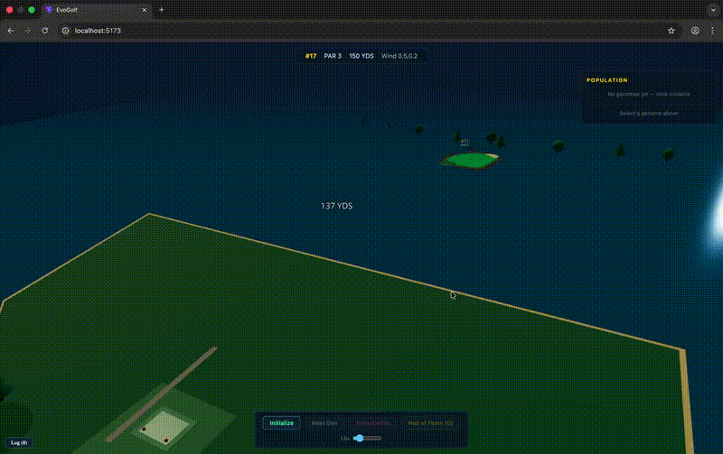

# EvoGolf

A 3D golf game where players evolve swing strategies through genetic programming. Instead of manually aiming each shot, you initialize a population of randomized GP trees that encode swing parameters (launch angle, power, spin), then watch natural selection optimize them generation by generation until one finds the hole.



## How It Works

1. **Initialize** a population of 12 random genomes — each is a syntax tree that computes swing parameters
2. **Simulate** — the server runs physics on every genome's shot (gravity, drag, wind, bounce, roll)
3. **Evaluate** — fitness is scored by proximity to the hole
4. **Evolve** — tournament selection, subtree crossover, and mutation breed the next generation
5. **Repeat** — auto-evolve or step manually until a ball sinks

All GP logic (tree generation, evaluation, physics, selection, crossover, mutation) runs server-side in SpacetimeDB reducers. The React Three Fiber client is a pure visualization layer — it subscribes to table changes and renders.

## Tech Stack

| Layer | Technology |
|-------|-----------|
| Database & Server Logic | [SpacetimeDB](https://spacetimedb.com) (TypeScript module) |
| 3D Rendering | React Three Fiber + Three.js |
| UI Framework | React 19 + Vite |
| Charts | Recharts |

## Features

- **GP Engine** — ramped half-and-half tree generation, context-sensitive evaluation, tournament selection, subtree crossover, 3-type mutation (subtree/point/hoist), plus fine-tune mutation for exploitation
- **Elite-Centered Breeding** — each generation: 1 elite (best genome carried forward) + 4 elite mutations (fine-tune + structural) + 1 elite crossover + 6 exploration offspring
- **Multiplayer** — multiple players evolve independently on the same course in real time, with a live leaderboard and the ability to inspect opponents' swings
- **3D Visualization** — instanced mesh ball swarm with animated trajectories, selectable genomes, orbit camera with follow and green-view modes
- **Swing Lab** — click any genome to see English descriptions ("High lob, full power, slight draw"), parameter bars, and the raw GP syntax tree
- **Auto-Evolve** — hands-off mode with adjustable speed; stops on hole-in-one
- **Course Rotation** — when any player sinks a ball, a new random course is generated; best genomes carry over
- **Hall of Fame** — winning players and their generation counts are recorded across courses
- **Stagnation Detection** — mutation rate boosts from 50% to 80% after 10 unchanged generations
- **Real-time Reactivity** — SpacetimeDB subscriptions push all state changes to every client instantly

## Multiplayer

EvoGolf supports simultaneous multiplayer — each player runs their own evolutionary population against the same course. Open multiple browser tabs to `localhost:5173` to simulate multiple players.

Each player gets:
- Their own color-coded balls and trajectories
- Independent evolution (Tee Off / Evolve controls per player)
- A shared leaderboard showing distance-to-hole rankings
- The ability to click other players' balls to inspect their genomes in the Swing Lab

When any player's genome finds the hole, the course rotates for everyone. Players can carry their best genome to the next course or start fresh.

**Breeding strategy per generation (12 genomes):**
| Slot | Count | Strategy |
|------|-------|----------|
| Elite | 1 | Best genome replicated unchanged |
| Elite Mutations | 4 | 2 fine-tune (Gaussian const perturbation) + 2 structural (point mutation) |
| Elite Crossover | 1 | Elite crossed with top finisher |
| Exploration | 6 | Tournament-selected crossover + mutation |

## Getting Started

### Prerequisites

- [Docker](https://docker.com)
- [SpacetimeDB CLI](https://spacetimedb.com/install) (v2.0+)
- Node.js 18+

### Run

```bash
# Start SpacetimeDB
docker compose up -d

# Publish server module & start client
make dev
```

The app will be available at `http://localhost:5173`.

### Commands

```bash
make dev         # Full startup: docker + publish + generate bindings + client dev server
make publish     # Publish server module to local SpacetimeDB
make generate    # Regenerate TypeScript client bindings
make reset       # Wipe all game data
make logs        # Tail server logs
```

## Project Structure

```
server/
  src/
    index.ts          # SpacetimeDB tables, schema, and reducers
    constants.ts      # Shared constants (physics, GP params)
    gp/
      types.ts        # TreeNode, SwingParams, EvalContext
      tree-gen.ts     # Ramped half-and-half population seeding
      evaluate.ts     # Context-sensitive tree evaluation
      physics.ts      # Ball flight simulation (gravity, drag, wind, bounce)
      fitness.ts      # Distance-to-hole fitness scoring
      selection.ts    # Tournament selection with wildcard override
      crossover.ts    # Subtree crossover with depth capping
      mutation.ts     # Subtree, point, hoist, and fine-tune mutation

client/
  src/
    App.tsx           # Main app — state management, 3D canvas, UI layout
    lib/
      swingDescription # Client-side tree evaluator for Swing Lab display
      ballFilters      # Filter balls/genomes by player identity
      colors           # Origin-based color coding
    components/
      CourseGround    # 3D golf course terrain
      BallSwarm       # Instanced mesh for all balls
      TrajectoryLines # Animated shot trajectories
      CameraController # Orbit, follow, green-view camera modes
      GPControlPanel  # Initialize, evolve, auto-evolve controls
      SwingLab        # Genome inspector — descriptions, param bars, tree view
      PlayerList      # Multiplayer leaderboard with opponent inspection
      FitnessChart    # Generation-over-generation fitness plot
      EventLog        # GP operation event feed
      HUD             # Course info overlay
      HallOfFame      # Archived winning genomes
      WinOverlay      # Hole-in-one celebration
```

## License

MIT
